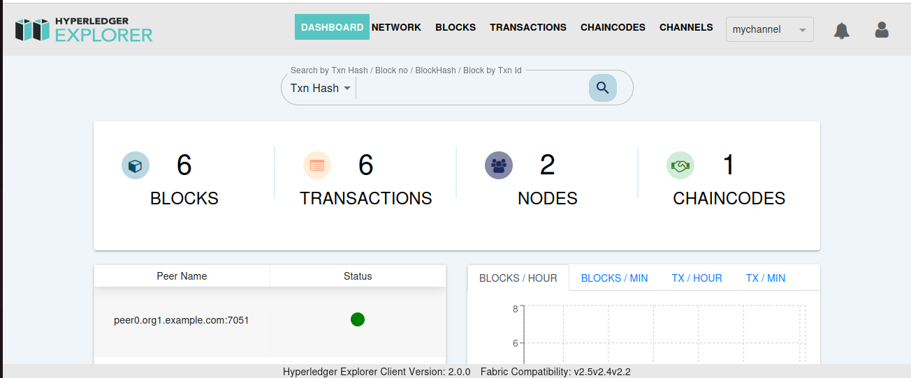
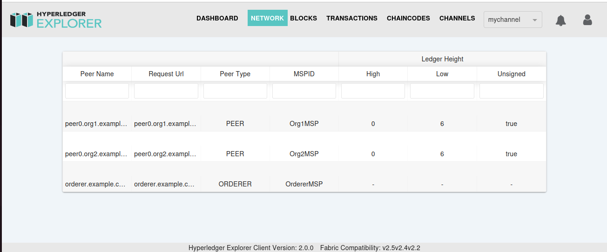
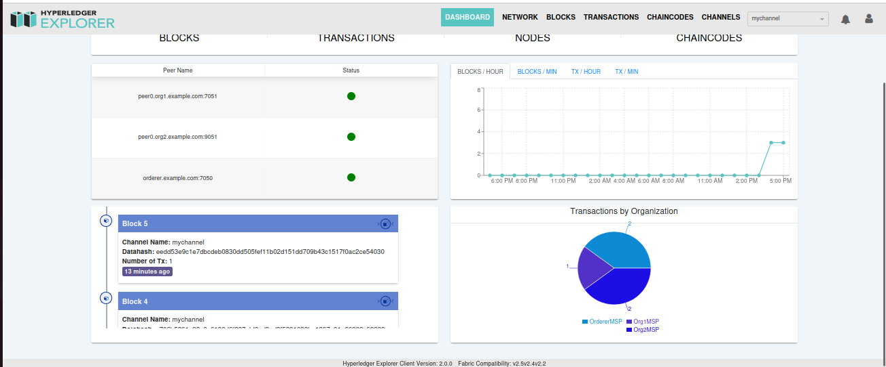

# Install Fabric Hyperledger 2.5.1 and Set Up Hyperledger Explorer

This guide provides step-by-step instructions for installing Fabric Hyperledger 2.5.1 and setting up Hyperledger Explorer to monitor your network.

## Prerequisites

- **Node.js**: Ensure you have Node.js version `v16.14.1` installed. This version works seamlessly as tested.

## Install Fabric Hyperledger 2.5.1

1. **Navigate to your home directory**:
   ```bash
   cd ~
   ```

2. **Install Fabric 2.5.1**:
   ```bash
   curl -sSL https://bit.ly/2ysbOFE | bash -s
   ```
   **Note**: This installs version 2.5.1. For more details about installation prerequisites, visit:
   - [Fabric 2.5 Documentation](https://hyperledger-fabric.readthedocs.io/en/release-2.5/getting_started.html)
   - [Latest Fabric Documentation](https://hyperledger-fabric.readthedocs.io/en/latest/)

3. **Add Fabric binaries to your PATH**:
   ```bash
   export PATH=$PATH:$PWD/bin
   ```

## Set Up a Fabric Network

1. **Navigate to the Fabric Samples directory**:
   ```bash
   cd fabric-samples
   ```

2. **Start the Test Network**:
   ```bash
   cd test-network
   ./network.sh up
   ```

3. **Bring Down the Network**:
   ```bash
   ./network.sh down
   ```

4. **Create a Channel**:
   ```bash
   ./network.sh createChannel -c mychannel
   ```

5. **Deploy a Chaincode**:
   ```bash
   ./network.sh deployCC -c mychannel -ccn basic -ccp ../asset-transfer-basic/chaincode-javascript/ -ccl javascript
   ```

6. **Return to the Home Directory**:
   ```bash
   cd ~
   ```

## Set Up Hyperledger Explorer

1. **Follow the Explorer Installation Guide**:
   Refer to the official documentation at [Hyperledger Explorer GitHub](https://github.com/hyperledger-labs/blockchain-explorer) and follow the steps relevant to your Fabric version.

**Note**: The `explorer` directory should be in the same directory where you installed Fabric Hyperledger.

## Troubleshooting

### Common Issues

1. **`ajv` Error**:
   - If you encounter an issue with `ajv` during `npm start` or while running `./main.sh` in the `client` folder, resolve it by installing the correct version of `ajv`:
     ```bash
     npm install ajv@6 --save
     ```
   - After installation, try running `npm start` again.

2. **Node.js and Fabric Version Compatibility**:
   - Ensure that the Node.js version is compatible with your Fabric version for seamless operation.

3. **Organization Files**:
   - Verify that the files in `~/fabric-samples/test-network/organizations` match the files in `~/explorer/organizations`. This ensures that any newly created organizations in Fabric are reflected correctly in Explorer.

## Notes

1. Consistency between Node.js and Fabric versions is crucial for smooth operation.
2. Always synchronize organization files between Fabric and Explorer to avoid configuration mismatches.

By following these steps, you should have a fully functional Fabric network monitored by Hyperledger Explorer.

# Result



